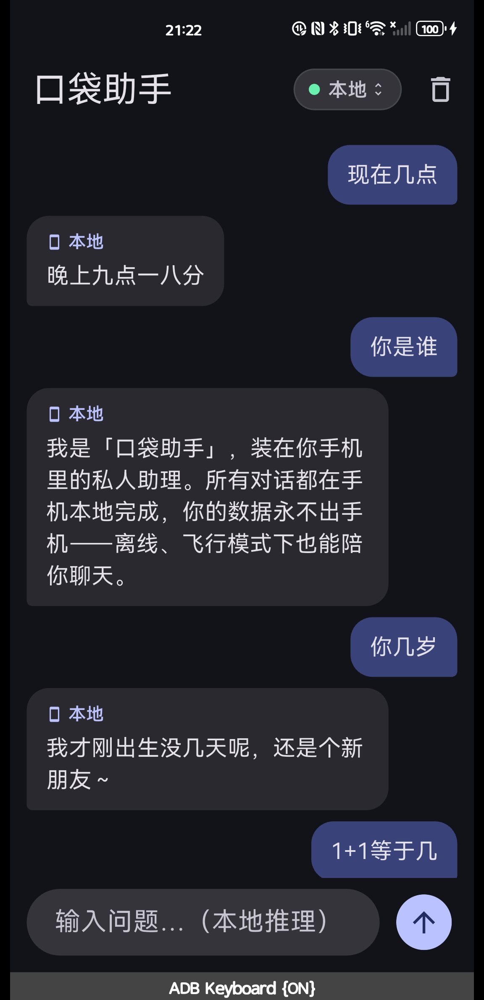
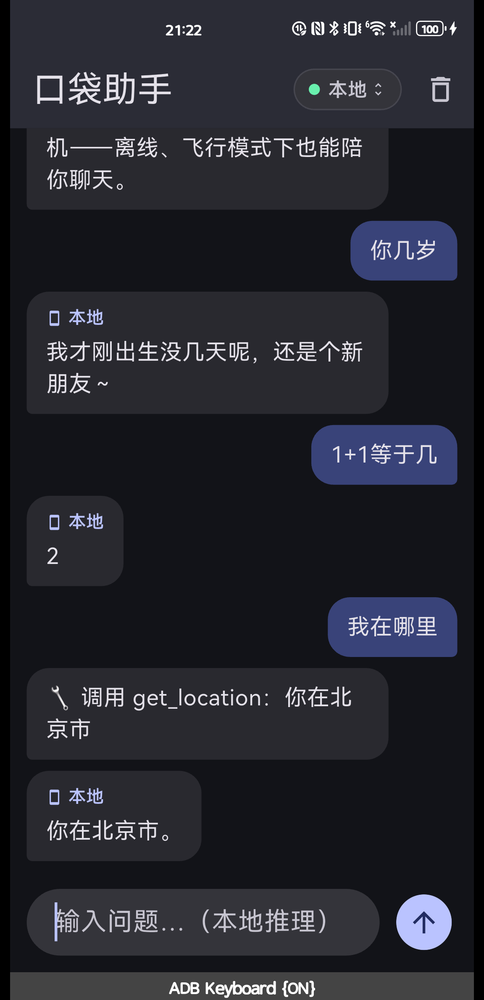

# 口袋助手 Pocket Assistant

> **让每个手机都拥有自己的 AI：本地为主，云端按需。数据永不出手机，离线也能聊。**

口袋助手是一款 iOS + Android 本地优先双引擎 AI 聊天 App。内置 1.5B 本地模型，飞行模式 / 地铁 / 海外也能离线使用；也可填入你自己的 API Key（BYO Key）免费直连云模型，引擎切换一键掌控。

**English**: Pocket Assistant is a local-first, dual-engine AI chat app. Built-in 1.5B on-device model keeps your data on your phone and works offline; bring-your-own-key lets you connect any OpenAI-compatible cloud model on demand.

---

## 效果预览（华为真机实拍）

日期/时间/星期由程序自动拼入，不依赖模型；人设身份问答统一回复。

| 日期/时间/星期 | 人设 · 位置 · 工具 |
|---|---|
|  |  |

## 核心能力（v0.1.0 · MVP P0 完成）

| 能力 | 说明 |
|---|---|
| 🔒 **本地离线** | 内置 Qwen2.5-1.5B 本地模型，离线可对话，数据不出手机 |
| 📶 **云端按需** | BYO Key 免费直连任意 OpenAI 兼容网关，引擎一键切换 |
| 🧰 **工具闭环** | 位置 / 天气 / 搜索三工具端到端可用；搜索在内置 WebView 内完成，不跳出 App |
| 💾 **历史持久化** | 对话记录 SQLite 本地存储，可追溯 |
| 🔐 **Key 安全存储** | BYO Key 存系统安全存储（iOS Keychain / Android Keystore），不落明文 |
| 🧩 **插件可扩展** | 应用场景通过技能（插件）加载，第二期做「手机版 Claude Code」 |

**实测（华为 Mate 30 Pro）**：`1+1=` 正确；「今天几号/星期几/现在几点」由程序注入真实当前时刻；「我在哪里」→ 工具返回城市级位置；「带伞建议」由天气工具给出。

## 下载与安装

| 渠道 | 状态 | 说明 |
|---|---|---|
| **GitHub Releases** | ✅ 已上线 | 见右侧/下方 Release，`v0.1.0` 附 APK |
| 应用商店（App Store / Google Play / 国内商店） | ⏸ 规划中 | 正式期上线 |

- 安装包：`pocket-assistant-0.1.0+1-arm64.apk`（arm64-v8a，Android 8.0+）
- SHA-256：`ec7c3250e04be257ef49dc26befaca45544bc57007b25e64d79f60ad82f91e22`
- 首次启动会自动下载本地模型（约 1.1GB，`/sdcard/Download`，蜂窝网络默认不自动下载）

> ⚠️ 灰度测试版，建议小范围体验；正式版待备案后上架。

## 本地模型与许可

内置模型基于 **Qwen2.5-1.5B-Instruct**（Apache License 2.0，`Copyright 2024 Alibaba Cloud`），由一言一行团队量化为 GGUF Q4_K_M 并作 SFT/DPO 微调。

- 模型许可：Apache License 2.0（详见 `LICENSE` 与 `NOTICE`）
- **本产品与阿里云 / Qwen 团队无关联，亦未经其认可**
- 推理引擎基于 llama.cpp / llamadart（MIT License），开源许可列表详见 App 内「设置 → 开源许可」

## AI 生成内容声明

- 本 App 为生成式 AI 应用，模型输出**可能不准确**，请自行核实
- 输出不构成医疗 / 法律 / 财务等专业意见
- 对话内容默认仅存于本机；切换云端引擎时，当次请求会发送至你所配置的网关，App 内有显式「云端」来源标识
- 模型安全对齐有限（1.5B），请勿用于敏感决策场景

## 构建 / 运行（开发者）

```bash
cd app
export PUB_HOSTED_URL=https://pub.flutter-io.cn   # 国内镜像
flutter pub get
flutter run                                       # 连真机/模拟器
flutter test                                      # 96 个测试
```

## 已知限制

- 意图识别粒度较粗（1.5B 能力边界），当前以触发词兜底 / 日期注入 / 人设统一答复缓解，第二期做技能化意图路由或模型升级
- iOS（缺 Xcode 后置）、HarmonyOS NEXT（P1 后置）
- 模拟器无 GPU 加速生成较慢；真机 Metal/Vulkan 快数倍

## License

本项目（仓库内代码与文档）采用 [Apache License 2.0](LICENSE)。内置模型权重许可详见 [NOTICE](NOTICE)。
